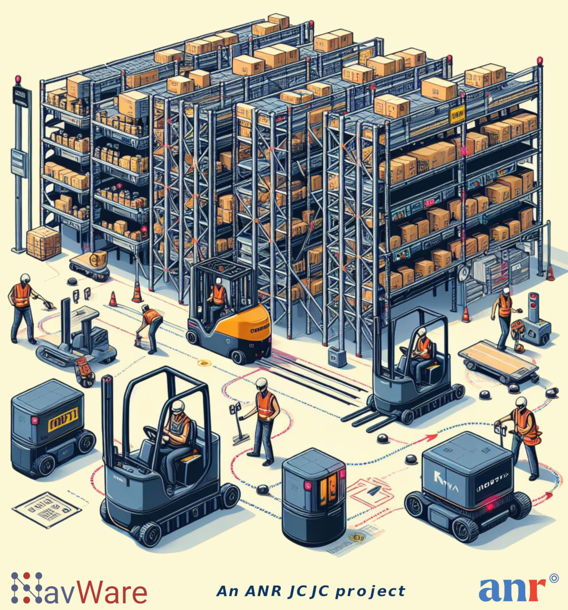

# Safe Worker-collaborative Navigation for Robotic Intralogistics in Infrastructure-free Warehouses

## News

\[2025-05-06\]: We participated in the ["Fabriquer Demain"](images/anr_colloque_25.jpg) conference organized by ANR!

\[2025-04-02\]: We had in-depth exchanges with the [industry](images/sitl2025.jpg) at [SITL](https://www.sitl.eu/)!

\[2025-04-01\]: We are excited to be the first users of the mass-produced [Tracer 2.0](videos/tracer2.mp4) from Agilex Robotics!

\[2025-03-26\]: Mr. Boyuan Zhang joined us as an intern!

\[2024-07-15\]: Mr. Johnata Brayan joined us as an intern!

\[2024-02-29\]: The project was kicked off!

## About

Welcome to NavWare, a *Jeunes Chercheuses et Jeunes Chercheurs (JCJC)* research project in the field of mobile robotics funded by the **French National Research Agency (ANR)**. NavWare's ambition is to advance existing automated intralogistics from AGV-based solutions to AMR-based ones, allowing mobile robots to truly work alongside human workers. The project proposes to use data-driven methods to intervene in the AMR's navigation layers for fast and reliable local obstacle avoidance and generalizable global path planning, and ultimately produce safe worker-collaborative robot navigation. NavWare will enable lower deployment and maintenance costs for AMRs in intralogistics and better system performance compared to existing technologies.

## Team

|  |  |  |  |
| :-: | :-: | :-: | :-: |
| [Zhi Yan](https://yzrobot.github.io/) (PI) Assistant Professor | [François Brémond](http://www-sop.inria.fr/members/Francois.Bremond/)  Research Director | [Johnata Brayan](https://scholar.google.com/citations?user=OxFeRc4AAAAJ)  Master's student | [Boyuan Zhang](https://fr.linkedin.com/in/boyuan-zhang-493776216)  Master's student |

## Publications

## Deliverables

| Number | Title | Type | Dissemination | Due month | Submitted |
| ------ | ----- | ---- | ------------- | --------- | --------- |
| D7.1 | NavWare project website online and social media appearance initialised | DEC | Public | M01 | ✅ |
| D7.2 | Initial data management plan | Report | Confidential | M06 | ✅ |
| D7.3 | [NavWare flyer](images/NavWare-flyer.jpg) | DEC | Public | M19 | ✅ |

## Follow us

---
This project has received funding from the French National Research Agency (ANR) under grant agreement No ANR-23-CE10-0016.

&nbsp;
&nbsp;
&nbsp;

